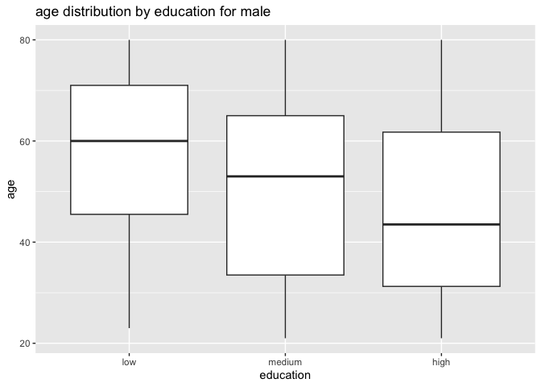
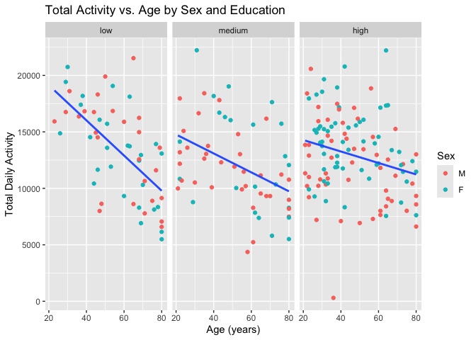
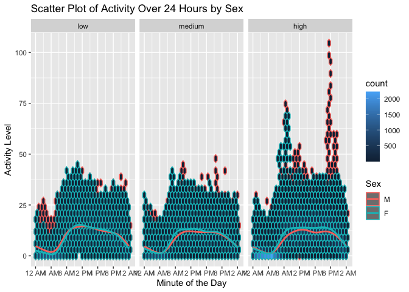

p8015_hw3_hc3563
================
Hanchuan Chen
2024-10-10

``` r
library(tidyverse)
library(patchwork)
```

### Problem 1

### Problem 2

``` r
covar_df = 
  read_csv("./data/nhanes_covar.csv", skip=4) |> 
  janitor::clean_names()

accel_df = 
  read_csv("./data/nhanes_accel.csv") |> 
  janitor::clean_names()

# merge dataset first, then do data cleaning
nhanes_df = left_join(covar_df, accel_df, by="seqn")
nhanes_df = 
  nhanes_df |> 
  filter(age >= 21) |> 
  mutate(sex = factor(sex, levels=c(1,2), labels=c("M","F"))) |> 
  mutate(education = factor(education, levels=c(1,2,3), labels=c("low","medium","high"))) |> 
  drop_na(bmi, education)
```

``` r
education_df = 
  nhanes_df |> 
  group_by(sex, education) |> 
  summarize(n_obs=n())

knitr::kable(education_df)
```

| sex | education | n_obs |
|:----|:----------|------:|
| M   | low       |    27 |
| M   | medium    |    35 |
| M   | high      |    56 |
| F   | low       |    28 |
| F   | medium    |    23 |
| F   | high      |    59 |

``` r
age_dist_M = 
  nhanes_df |> 
  filter(sex == "M") |> 
  ggplot(aes(x=education, y=age)) + 
  geom_boxplot() +
  labs(
    title = "age distribution by education for male"
  )
  
age_dist_F =
  nhanes_df |> 
  filter(sex == "F") |> 
  ggplot(aes(x=education, y=age)) + 
  geom_boxplot() +
  labs(
    title = "age distribution by education for female"
  )  

print(age_dist_M)
```

<!-- -->

``` r
print(age_dist_F)
```

<!-- -->

By looking at the distribution of age by sex and education, generally
speaking older people tend to have lower education degree and young
people have higher education degree. To compare the female and male,
there are more female had medium degree, which is high school
equivalent, than male had.

``` r
nhanes_df = 
  nhanes_df |> 
  mutate(total = rowSums(select(nhanes_df,min1:min1440)))

ggplot(nhanes_df, aes(x = age, y = total)) +
  geom_point(aes(color = sex)) +
  geom_smooth(method="lm", se = FALSE) +
  facet_wrap(~education) +
  labs(
    title = "Total Activity vs. Age by Sex and Education",
    x = "Age (years)",
    y = "Total Daily Activity",
    color = "Sex"
  )
```

<!-- -->
From these plots, we can see that older people have less total daily
activity than young people, but there is no significant relationship
between sex and total activity. Also, people with lower education have
more activity in young age than medium and high education people but
have less activity when they getting old.

``` r
df_long = 
  pivot_longer(
    nhanes_df,
    min1:min1440,
    names_to = "minute",
    names_prefix = "min",
    values_to = "activity"
  )

df_long =
  df_long |> mutate(minute = as.numeric(minute))

plt = 
  ggplot(df_long, aes(x=minute, y=activity, color=sex)) +
  geom_hex() +
  geom_smooth(se = FALSE) +
  facet_wrap(~education) +
  labs(
    title = "Scatter Plot of Activity Over 24 Hours by Sex",
    x = "Minute of the Day",
    y = "Activity Level",
    color = "Sex"
  ) +
  scale_x_continuous(
    breaks = seq(0, 1440, by = 240),  # Label x-axis at 4-hour intervals
    labels = c("12 AM", "4 AM", "8 AM", "12 PM", "4 PM", "8 PM", "12 AM")
  )

print(plt)
```

    ## `geom_smooth()` using method = 'gam' and formula = 'y ~ s(x, bs = "cs")'

<!-- -->
According to this hex plot, we can see that no matter education level,
people tend to have less activity between 12 am and 6 am with the least
activity at 4 am. Also, male usually have most activity at 9 am, while
female have most activity at 8 pm. As we compare the education level,
the distribution of activity between low and medium is similar, while
high education level have overall more activity than the other two
levels. The peak activity for male and female for high education level
is much higher than low and medium levels. \### Problem 3
